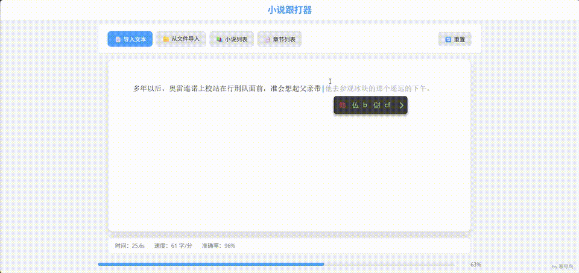

# 小说跟打器

中文打字练习工具 - 常规跟打器一般一个区域显示待跟打文章，另一个区域用于输入。本项目合并输入区与显示区，光标后显示待输入内容，提供沉浸式跟打体验。

——整个项目几乎完全依赖AI生成代码(Claude Code + Qwen3.5-Plus)。
## 效果演示



## 功能特性

- **创新融合界面**：将输入区与文章显示区合二为一，光标后实时显示待输入文本，沉浸式跟打体验
- **章节管理**：自动识别小说章节，支持章节列表选择和切换
- **进度保存**：每本小说只保留一个进度，完成一章后自动保存到下一章开头
- **小说管理**：上传的小说自动保存，可随时加载已保存的小说
- **打字统计**：实时显示时间、速度（字/分）
- **进度恢复**：刷新页面后自动恢复练习进度
- **主题切换**：支持浅色、深色、绿色护眼三种主题
- **行数限制**：可自定义显示未跟打文本的行数，避免过多内容干扰
- **符号跳过**：支持自动跳过标点符号，专注于文字输入

## 使用方法

### 方式一：直接使用（推荐）

直接下载[html](dist/index.html)文件，双击用浏览器打开即可使用，无需安装任何依赖。

### 方式二：从源码构建

```bash
# 安装依赖
npm install

# 启动开发服务器
npm run dev

# 构建生产版本
npm run build
```

构建完成后，生成的 `dist/index.html` 即可直接使用。

## 操作说明

1. **导入文本**：点击"导入文本"按钮粘贴小说内容，或从本地上传 `.txt` 文件
2. **章节选择**：如果文本包含章节结构，会自动识别并显示章节列表
3. **开始练习**：点击下方输入区域聚焦，然后直接输入文字开始跟打
4. **切换章节**：完成一章后按任意键进入下一章，或通过章节列表选择
5. **加载已保存**：点击"小说列表"按钮加载之前练习过的小说
6. **主题切换**：点击"设置"按钮，可选择浅色、深色或绿色护眼主题
7. **符号跳过**：在设置中勾选"不跟打符号"可自动跳过标点符号，支持自定义跳过符号
8. **行数限制**：在设置中可设置未跟打文本显示行数，0 表示全部显示，1 表示只显示当前行

## 技术栈

- **框架**：Vue 3 + TypeScript
- **构建工具**：Vite
- **样式**：原生 CSS（CSS 变量主题）
- **数据存储**：LocalStorage
- **开发工具**: Claude Code + Qwen3.5-Plus

## 章节识别规则

### 默认识别规则

自动识别"第 X 章"格式的章节标题，例如：
- 第一章
- 第 1 章
- 第二十五章
- 第 100 章

### 自定义章节匹配正则

如果默认规则无法识别你的小说章节格式，可以在导入时自定义正则表达式：

1. 点击"导入文本"或"从文件导入"
2. 勾选"使用自定义章节匹配正则"
3. 输入你的正则表达式
4. 点击"确定"导入

**支持的格式：**
- 纯正则字符串：`^[0-9]+、`
- 带斜杠格式：`/^\d+/`

**常用示例：**
| 章节格式 | 正则表达式 |
|---------|-----------|
| `1、归零` | `^[0-9]+、` |
| `Chapter 1` | `^Chapter\s*\d+` |
| `第一节` | `^第 [一二三四五六七八九十百千万\d]+节` |
| `Part I` | `^Part\s+[IVXLCDM]+` |

**提示：** 自定义正则会保存到浏览器，下次导入时自动加载。

## 进度保存说明

- 每本小说只保留一个进度（包含当前章节索引和光标位置）
- 完成一章时，进度自动保存为下一章的开头
- 刷新页面或重新加载小说时，会提示是否恢复进度
- 数据存储在浏览器 LocalStorage 中，无需服务器

## 作者

[yijuan7](https://github.com/yijuan7)

## 许可证

本项目采用 [CC BY-NC 4.0](https://creativecommons.org/licenses/by-nc/4.0/) 许可协议授权。

您可以自由地：
- **共享** — 以任何媒介或格式复制、发行本作品
- **改编** — 修改、转换或以本作品为基础进行创作

惟须遵守下列条件：
- **署名** — 您必须给出适当的署名
- **非商业性使用** — 您不得将本作品用于商业目的

使用本作品时，请注明：
```
基于 yijuan7 的 chinese-novel-typing 项目
https://github.com/yijuan7/chinese-novel-typing
```